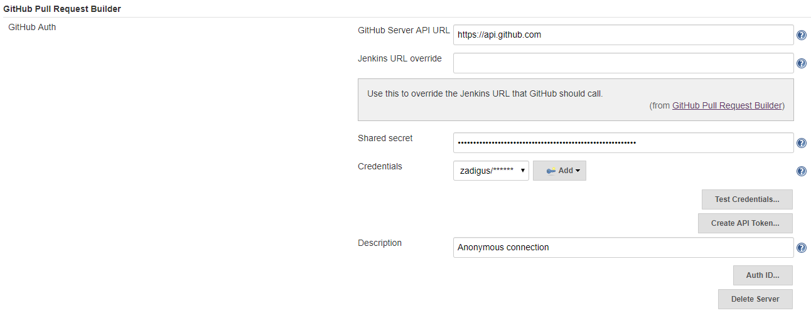
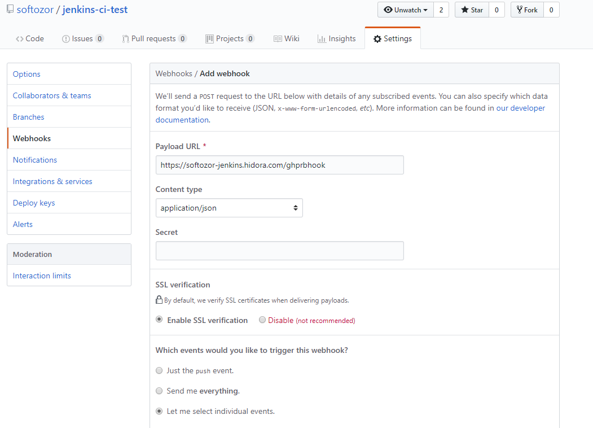

# Automatic test runs with Jenkins on Jelastic

We need to have jenkins deploy our code to our Jelastic environments and run the (unit, acceptance, and end-to-end) tests. To do that, we need to configure a pipeline. Let's start easy with a "Hello World!" example with a github repository. For the examples using github webhooks to work, we've had to deactivate the 2-factor authentication.

## Jenkins setup on Jelastic

1. Install Jenkins from the marketplace
2. Upon Jenkins startup, give the password that is found under `jenkins_home/secrets/initialAdminPassword`
2.1 Anytime later when you want to log in, you need that password as well as the username `admin`
3. Upon Jenkins startup, install the default packages

## Minimalistic pipeline

The minimalistic pipeline will work without anything else installed on Jenkins. It's purpose is to checkout this github project and run its pipeline configuration read from its [Jenkinsfile](Jenkinsfile_minimal_HelloWorld). The pipeline is launched manually.

In Jenkins, add new pipeline item. Then, in the `General` section,

* Check "GitHub project" checkbox and provide "Project url"

In the `Pipeline` section,

* select Definition "Pipeline script from SCM"
* provide the github's repository access data
* make sure the Script Path is filled up with the correct path to the `Jenkinsfile`

## Automatic minimalistic pipeline

The pipeline is the same as before. The only difference is that it is automatically run everytime there is a merged pull request on the `master` branch.

In Jenkins' plugin manager,

* Switch to "Available" tab
* Filter for "pull"
* Install "GitHub Pull Request Builder"

Following [this advice](https://devopscube.com/jenkins-build-trigger-github-pull-request/), go to "Manage Jenkins --> Configure System" and look for "Github Pull Request Builder". There you can enter your credentials:

In your github's repository, add a webhook:

In that interface, choose option "Let me select individual events." and select "Pull requests".